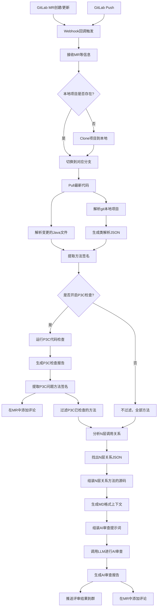

## 调用链影响分析

### 架构设计

```mermaid
flowchart TB
    A[GitLab MR创建/更新] --> B[Webhook回调触发]
    A2[GitLab Push] --> B[Webhook回调触发]
    B --> C[接收MR等信息]
    C --> D{本地项目是否存在?}
    D -->|否| E[Clone项目到本地]
    D -->|是| F[切换到对应分支]
    E --> F
    F --> G[Pull最新代码]
    G --> M[解析变更的Java文件]
    G --> M2[解析git本地项目]
    M2 --> P[生成类解析JSON]
    M --> Q[提取方法签名]
    P --> Q
    Q --> H{是否开启P3C检查?}
    H -->|是| I[运行P3C代码检查]
    I --> K[生成P3C检查报告]
    K --> L[提取P3C问题方法签名]
    L --> N[在MR中添加评论]
    L --> S[过滤P3C已检查的方法]
    H -->|否| T[不过滤，全部方法]
    S --> U[分析N层调用关系]
    T --> U
    U --> V[找出N层关系JSON]
    V --> W[组装N层关系方法的源码]
    W --> X[生成MD格式上下文]
    X --> Y[组装AI审查提示词]
    Y --> Z[调用LLM进行AI审查]
    Z --> AA[生成AI审查报告]
    AA --> EE[推送评审结果到群]
    AA --> FF[在MR中添加评论]
```


### windows git filename to long
```shell
git config --global core.longpaths true
git config --global core.protectNTFS false
```